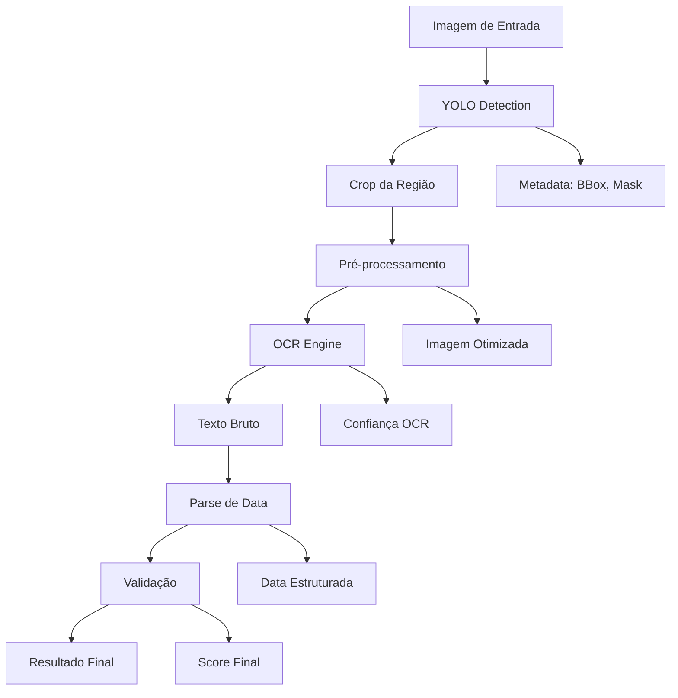

# 🌊 Fluxo de Dados

> Jornada completa dos dados pelo sistema Datalid 3.0

## 📋 Índice

- [Visão Geral](#visão-geral)
- [Fluxo Detalhado](#fluxo-detalhado)
- [Transformações de Dados](#transformações-de-dados)
- [Estados dos Dados](#estados-dos-dados)
- [Armazenamento e Cache](#armazenamento-e-cache)

## 🎯 Visão Geral



## 🔄 Fluxo Detalhado

### Etapa 1: Entrada de Dados

**Input:** Imagem do produto (JPEG, PNG, etc.)

```python
# Formato de entrada
{
    "image_path": "/path/to/image.jpg",
    "image_data": np.ndarray,  # Shape: (H, W, 3), dtype: uint8
    "metadata": {
        "width": 1920,
        "height": 1080,
        "format": "JPEG",
        "size_bytes": 524288
    }
}
```

**Transformações:**
1. Leitura do arquivo via OpenCV
2. Conversão de BGR para RGB
3. Normalização de canais (0-255)
4. Opcional: Redimensionamento se > max_size

### Etapa 2: Detecção YOLO

**Processo:**

```python
# Input
image_rgb: np.ndarray  # Shape: (H, W, 3)

# YOLO Processing
preprocessed = yolo_preprocess(image_rgb)  # Normalização, padding
predictions = model.predict(preprocessed)
detections = nms_filter(predictions, conf=0.25, iou=0.45)

# Output
{
    "detections": [
        {
            "bbox": [x1, y1, x2, y2],  # Coordenadas absolutas
            "confidence": 0.94,
            "class_id": 0,
            "class_name": "expiry_date",
            "mask": np.ndarray,  # Shape: (N, 2), polígono
            "area": 12500  # pixels
        }
    ],
    "inference_time": 0.32  # segundos
}
```

**Transformações:**
1. Redimensionamento para 640x640 (ou imgsz configurado)
2. Padding para manter aspect ratio
3. Normalização (0-1)
4. Inference no modelo
5. Post-processing (NMS, thresholding)
6. Conversão de coordenadas relativas para absolutas

### Etapa 3: Extração de Região (Crop)

**Processo:**

```python
# Para cada detecção
for detection in detections:
    # Expandir bounding box com padding
    x1, y1, x2, y2 = expand_bbox(
        detection['bbox'], 
        padding=10,
        img_shape=(H, W)
    )
    
    # Crop da região
    crop = image_rgb[y1:y2, x1:x2]
    
    # Opcional: aplicar máscara de segmentação
    if use_mask:
        mask = detection['mask']
        crop = apply_polygon_mask(crop, mask)
```

**Output:**
```python
{
    "crop_id": 0,
    "image": np.ndarray,  # Shape: (h, w, 3)
    "original_bbox": [x1, y1, x2, y2],
    "crop_size": (165, 55),
    "detection_confidence": 0.94
}
```

### Etapa 4: Pré-processamento

**Pipeline de transformações:**

```python
crop_processed = crop.copy()

# 1. Correção de perspectiva (se necessário)
if config.deskew:
    crop_processed = deskew_image(crop_processed)

# 2. Redimensionamento (manter legibilidade)
if config.resize:
    crop_processed = smart_resize(
        crop_processed,
        max_height=64,
        maintain_aspect=True
    )

# 3. Normalização de cor
if config.normalize:
    crop_processed = normalize_channels(crop_processed)

# 4. Melhoria de contraste
if config.clahe:
    crop_processed = apply_clahe(
        crop_processed,
        clip_limit=2.0,
        tile_size=8
    )

# 5. Remoção de ruído
if config.denoise:
    crop_processed = denoise(crop_processed, strength=5)

# 6. Aumento de nitidez
if config.sharpen:
    crop_processed = sharpen(crop_processed, amount=1.5)

# 7. Binarização adaptativa
if config.binarize:
    crop_processed = adaptive_threshold(
        crop_processed,
        block_size=11,
        c=2
    )
```

**Output:**
```python
{
    "preprocessed_image": np.ndarray,  # Otimizado para OCR
    "transformations_applied": [
        "clahe", "denoise", "sharpen", "binarize"
    ],
    "final_size": (128, 48)
}
```

### Etapa 5: OCR

**Processo por Engine:**

#### OpenOCR
```python
# Input: preprocessed_image (RGB ou grayscale)
text, confidence = openocr_engine.recognize(preprocessed_image)

# Output
{
    "engine": "openocr",
    "text": "VAL 15/03/2025",
    "confidence": 0.92,
    "inference_time": 0.8
}
```

#### PARSeq
```python
# Requer PIL Image
pil_image = Image.fromarray(preprocessed_image)
text, confidence = parseq_engine.recognize(pil_image)

# Output
{
    "engine": "parseq",
    "text": "VAL 15/03/2025",
    "confidence": 0.89,
    "character_confidences": [0.95, 0.91, 0.88, ...],
    "inference_time": 0.6
}
```

**Estrutura de saída unificada:**
```python
{
    "ocr_results": [
        {
            "crop_id": 0,
            "engine": "openocr",
            "text": "VAL 15/03/2025",
            "confidence": 0.92,
            "bounding_boxes": [  # Algumas engines retornam
                {"char": "V", "bbox": [0, 0, 10, 20], "conf": 0.95},
                {"char": "A", "bbox": [12, 0, 22, 20], "conf": 0.93},
                ...
            ],
            "alternatives": [  # Beam search top-k
                {"text": "VAL 15/03/2025", "conf": 0.92},
                {"text": "VAL 15/03/2026", "conf": 0.05}
            ]
        }
    ]
}
```

### Etapa 6: Parse de Data

**Processo:**

```python
from src.ocr.postprocessors import DateParser

parser = DateParser(config)

for ocr_result in ocr_results:
    text = ocr_result['text']
    
    # 1. Limpeza de texto
    cleaned = clean_text(text)
    # "VAL 15/03/2025" -> "15/03/2025"
    
    # 2. Extração de padrões
    date_candidates = extract_date_patterns(cleaned)
    # ["15/03/2025", "15-03-2025", "15.03.2025"]
    
    # 3. Parse com formatos conhecidos
    parsed_dates = []
    for candidate in date_candidates:
        for fmt in date_formats:
            try:
                date_obj = datetime.strptime(candidate, fmt)
                parsed_dates.append({
                    "date": date_obj,
                    "format": fmt,
                    "original_text": candidate
                })
            except ValueError:
                continue
    
    # 4. Validação
    valid_dates = validate_dates(parsed_dates)
    # Remove datas impossíveis (ano < 2020, > 2050, etc.)
    
    # 5. Scoring
    scored_dates = score_dates(valid_dates, ocr_result['confidence'])
```

**Output:**
```python
{
    "parsed_dates": [
        {
            "date": "15/03/2025",
            "date_object": datetime(2025, 3, 15),
            "format": "%d/%m/%Y",
            "confidence": 0.93,
            "original_text": "VAL 15/03/2025",
            "days_until_expiry": 127,
            "is_expired": False,
            "is_valid": True,
            "validation_checks": {
                "format_valid": True,
                "date_reasonable": True,
                "in_future": True
            }
        }
    ]
}
```

### Etapa 7: Seleção da Melhor Data

**Critérios de seleção:**

```python
def select_best_date(parsed_dates):
    """
    Seleciona a melhor data baseado em múltiplos critérios.
    """
    if not parsed_dates:
        return None
    
    # Scoring composto
    for date in parsed_dates:
        score = 0.0
        
        # 1. Confiança do OCR (peso: 40%)
        score += 0.4 * date['confidence']
        
        # 2. Formato comum (peso: 20%)
        if date['format'] in COMMON_FORMATS:
            score += 0.2
        
        # 3. Data futura razoável (peso: 20%)
        days = date['days_until_expiry']
        if 0 < days < 730:  # 2 anos
            score += 0.2 * (1 - abs(days - 365) / 365)
        
        # 4. Consistência (peso: 20%)
        # Se múltiplas datas, favorecer a mais comum
        score += 0.2 * date['occurrence_count'] / max_occurrences
        
        date['final_score'] = score
    
    # Retornar data com maior score
    return max(parsed_dates, key=lambda x: x['final_score'])
```

**Output Final:**
```python
{
    "best_date": {
        "date": "15/03/2025",
        "confidence": 0.93,
        "days_until_expiry": 127,
        "is_expired": False,
        "expiry_status": "valid",
        "warning_level": "none",  # none, near_expiry, expired
        "source": {
            "detection_bbox": [120, 340, 285, 395],
            "detection_confidence": 0.94,
            "ocr_engine": "openocr",
            "ocr_confidence": 0.92,
            "format_detected": "DD/MM/YYYY"
        }
    },
    "all_candidates": [...],  # Todas as datas encontradas
    "processing_time": {
        "detection": 0.32,
        "preprocessing": 0.12,
        "ocr": 0.81,
        "parsing": 0.02,
        "total": 1.27
    }
}
```

## 📊 Estados dos Dados

### Estado 1: Imagem Original
- **Formato:** RGB ou BGR array
- **Shape:** (H, W, 3)
- **Dtype:** uint8
- **Range:** 0-255
- **Tamanho:** ~1-5 MB (JPEG comprimido)

### Estado 2: Imagem YOLO-Preprocessed
- **Formato:** RGB float32
- **Shape:** (640, 640, 3) ou (imgsz, imgsz, 3)
- **Dtype:** float32
- **Range:** 0-1
- **Transformações:** Redimensionamento + padding + normalização

### Estado 3: Crop de Região
- **Formato:** RGB uint8
- **Shape:** (h, w, 3), tipicamente (40-100, 80-300, 3)
- **Dtype:** uint8
- **Range:** 0-255
- **Tamanho:** ~10-50 KB

### Estado 4: Crop Pré-processado
- **Formato:** RGB ou Grayscale
- **Shape:** (h', w', c) onde c=1 ou 3
- **Dtype:** uint8
- **Range:** 0-255 ou binário (0, 255)
- **Transformações:** CLAHE + denoise + sharpen + binarize

### Estado 5: Texto Extraído
- **Formato:** String UTF-8
- **Conteúdo:** "VAL 15/03/2025"
- **Metadata:** Confidence score, bounding boxes

### Estado 6: Data Estruturada
- **Formato:** datetime object + metadata
- **Componentes:** day, month, year
- **Validação:** Checks aplicados
- **Score:** Confiança final

## 💾 Armazenamento e Cache

### Estrutura de Outputs

```
outputs/
├── pipeline/
│   ├── image1_result.jpg           # Visualização final
│   ├── image1_results.json         # Dados estruturados
│   ├── image1_crop_0.jpg          # Crop da região
│   └── image1_preprocessed_0.jpg  # Após pré-processamento
│
├── pipeline_steps/
│   ├── 001_original.jpg
│   ├── 002_detection.jpg
│   ├── 003_crop.jpg
│   ├── 004_preprocessed.jpg
│   └── 005_final.jpg
│
└── logs/
    └── pipeline_YYYYMMDD_HHMMSS.log
```

### Cache de Modelos

```python
# Modelos YOLO são cached automaticamente
cache_dir = Path.home() / ".cache" / "datalid"
yolo_cache = cache_dir / "yolo" / "yolov8n-seg.pt"

# Modelos OCR (torch.hub)
torch_cache = Path.home() / ".cache" / "torch" / "hub"
parseq_cache = torch_cache / "baudm_parseq_main"
```

### Metadata Persistida

```json
{
    "session_id": "uuid-123",
    "timestamp": "2024-11-08T14:30:00",
    "config": {
        "detection": {...},
        "ocr": {...},
        "parsing": {...}
    },
    "results": [...],
    "statistics": {
        "total_images": 100,
        "successful": 95,
        "failed": 5,
        "avg_processing_time": 1.2,
        "avg_confidence": 0.91
    }
}
```

## 🔄 Transformações de Dados - Resumo Visual

```
┌─────────────────┐
│ Imagem Original │  RGB, (1920x1080x3), 2.5MB
└────────┬────────┘
         │ resize + normalize
         ▼
┌─────────────────┐
│ YOLO Input      │  RGB float, (640x640x3), normalized
└────────┬────────┘
         │ inference
         ▼
┌─────────────────┐
│ Detections      │  BBox + Mask + Confidence
└────────┬────────┘
         │ crop
         ▼
┌─────────────────┐
│ Crop            │  RGB, (165x55x3), 28KB
└────────┬────────┘
         │ CLAHE + denoise + binarize
         ▼
┌─────────────────┐
│ Preprocessed    │  Grayscale, (165x55), optimized for OCR
└────────┬────────┘
         │ OCR inference
         ▼
┌─────────────────┐
│ Text            │  "VAL 15/03/2025", conf=0.92
└────────┬────────┘
         │ regex + parse
         ▼
┌─────────────────┐
│ Date Object     │  datetime(2025, 3, 15)
└────────┬────────┘
         │ validate + score
         ▼
┌─────────────────┐
│ Final Result    │  {date, confidence, days_to_expiry, ...}
└─────────────────┘
```

## 📈 Métricas de Fluxo

### Throughput Típico
- **Detecção YOLO:** ~3 FPS (GPU), ~0.5 FPS (CPU)
- **OCR:** ~1.2 segundos/crop (varia por engine)
- **Parse:** ~0.02 segundos
- **Total:** ~1-2 segundos/imagem (GPU)

### Tamanhos de Dados
- **Input:** 1-5 MB (imagem JPEG)
- **Memória YOLO:** ~500 MB (modelo + tensors)
- **Memória OCR:** ~1-2 GB (depende do engine)
- **Output JSON:** ~2-10 KB

### Bottlenecks
1. 🐌 **OCR inference** (70% do tempo total)
2. 🐌 **Carregamento de modelos** (inicialização)
3. 🐌 **I/O de disco** (se muitas visualizações)

## 💡 Otimizações

### Batch Processing
```python
# Processar múltiplas imagens juntas
results = pipeline.process_batch([img1, img2, img3])
# Compartilha overhead de inicialização
```

### Cache de Preprocessamento
```python
# Cache de crops já processados
crop_cache = {}
cache_key = hash(crop.tobytes())
if cache_key in crop_cache:
    preprocessed = crop_cache[cache_key]
```

### Lazy Loading de OCR Engines
```python
# Só carrega engine quando necessário
engine = get_or_load_engine(engine_name)
```

## 📚 Próximos Passos

- **[Arquitetura do Sistema](04-ARCHITECTURE.md)** - Componentes e interações
- **[Sistema OCR](08-OCR-SYSTEM.md)** - Detalhes dos engines OCR
- **[Pré-processamento](09-PREPROCESSING.md)** - Técnicas de otimização de imagens

---

**Dúvidas sobre o fluxo de dados?** Consulte [FAQ](25-FAQ.md) ou [Troubleshooting](22-TROUBLESHOOTING.md)
